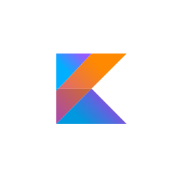
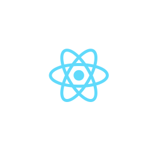
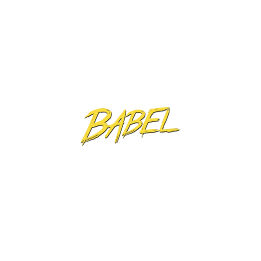

# Hi, I'm Gourav Goutam 

## I am Fullstack Developer

- 🌍 I'm based in Bangalore, India
- 🖥️ See my portfolio at <a target="_blank" rel="noreferrer" href='https://gourav-goutam.netlify.com/'>Portfolio</a>
- 🧠 Currently learning Advance React topics & Kotlin
- 🤝 I'm open to collaborating on interesting projects

### Skills

#### Backend

#### Frontend

 Thanks
